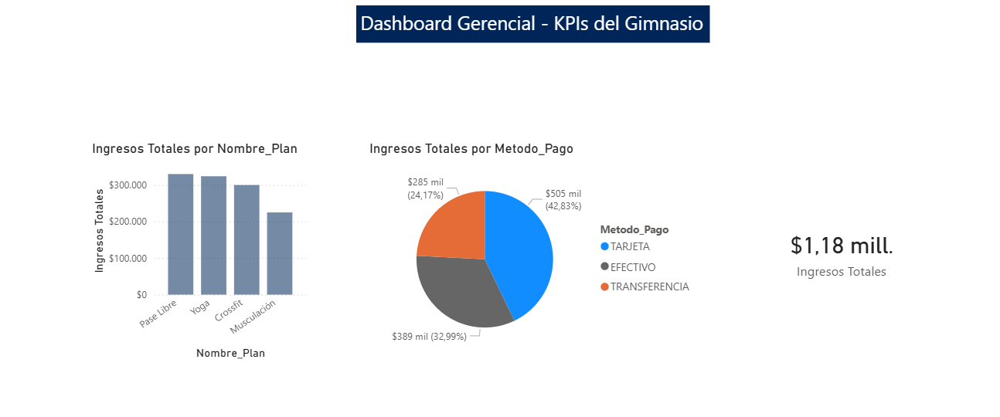

# Análisis de Datos Gerencial - Gimnasio

Este repositorio contiene el pipeline de datos y el análisis de inteligencia de negocio (BI) simulado para la gestión de un gimnasio, desarrollado como proyecto de portfolio.

## Stack Tecnológico
* **Procesamiento y ETL:** Python, Pandas, Numpy.
* **Inteligencia de Negocio:** Power BI, DAX.
* **Control de Versiones:** Git, GitHub.

## Descripción del Proyecto
El proyecto abarca el ciclo completo de los datos:
1. **Generación y Limpieza (ETL):** Creación de datos transaccionales (Socios, Planes, Pagos) y limpieza exhaustiva (manejo de valores nulos, estandarización de strings) utilizando scripts de Python y la librería Pandas.
2. **Modelado Relacional:** Estructuración de los datos exportados mediante un Modelo en Estrella (Star Schema) optimizado para su consumo analítico.
3. **Visualización y KPIs:** Diseño de un tablero interactivo y profesional en Power BI. Se implementaron expresiones DAX (como `SUMX` y `RELATED`) para calcular métricas críticas de negocio, incluyendo Ingresos Totales, rendimiento por tipo de plan y distribución de métodos de pago.

## Estructura del Repositorio
* `generador_datos.py`: Script de Python con el proceso automatizado de extracción y transformación (ETL).
* `DB_Gimnasio.xlsx`: Base de datos procesada, limpia y lista para ingestar.
* `dashboard_gimnasio.pbix`: Tablero interactivo de Power BI con el análisis visual, financiero y paleta de colores corporativa.